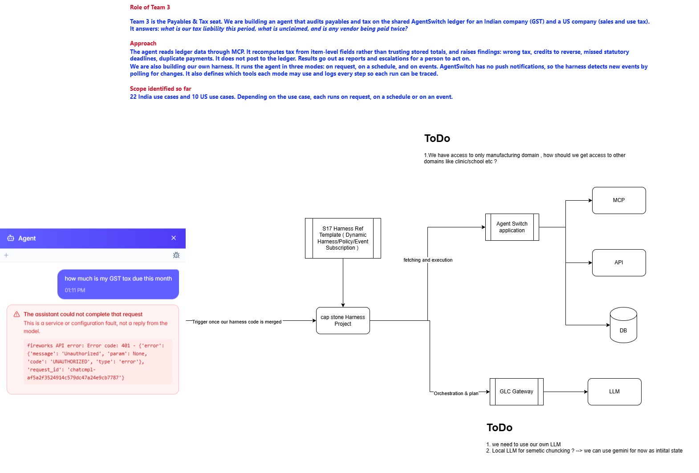

# docs/ — Team 03 · Seat 03 (Payables & Tax)

| Folder | What's in it | Start with |
|---|---|---|
| [`planning/`](planning/) | What we're building and how | [`spec.md`](planning/spec.md) — the 22 use cases · [`assignment.md`](planning/assignment.md) — workstreams · [`agent_design.md`](planning/agent_design.md) — agent design of record · [`usecase_feasibility.md`](planning/usecase_feasibility.md) — all 66 use cases: achievable?, MCP tools, already requested?, sample question, mode, playbook · [`harness_plan.md`](planning/harness_plan.md) — earlier harness design (superseded) |
| [`usecases/`](usecases/README.md) | Detailed specs, one file per use case, by jurisdiction, plus the **full catalogue** (domain × jurisdiction coverage, playbook grouping, exclusions) | [`README.md`](usecases/README.md) — catalogue of 66 · [`IN/`](usecases/IN/README.md) — UC-01…44 (GST) · [`US/`](usecases/US/README.md) — US-01…22 (sales & use tax) |
| [`submissions/`](submissions/) | What we report to the AgentSwitch platform team | [`agentswitch_submissions.md`](submissions/agentswitch_submissions.md) — every bug and feature request, tallied with the class bug board · [`submission_tracker.md`](submissions/submission_tracker.md) — status only · [`requested_tools.md`](submissions/requested_tools.md) — MCP tools we need · [`bugs_to_file_2026-09-30.md`](submissions/bugs_to_file_2026-09-30.md) — N9–N13 (filed) |
| [`gapreports/`](gapreports/) | How AgentSwitch compares with competitor products | [`gap_report.md`](gapreports/gap_report.md) — all six · [`razorpay_gap_report.md`](gapreports/razorpay_gap_report.md) · [`clear_gap_report.md`](gapreports/clear_gap_report.md) · [`gap_report_mysa.md`](gapreports/gap_report_mysa.md) |
| [`platform/`](platform/) | Reference material on the AgentSwitch platform itself | [`Capstone.jpg`](platform/Capstone.jpg) — overview diagram (below) · [`mcp_tool_inventory_india.md`](platform/mcp_tool_inventory_india.md) / [`_us`](platform/mcp_tool_inventory_us.md) — live tool lists · [`UI.MD`](platform/UI.MD) — screen inventory · [`screen_api_mapping.md`](platform/screen_api_mapping.md) — screens → API calls |

Project-level documents stay one level up: [`../SKILL.md`](../SKILL.md) (agent charter,
loaded by `run_agent.py`), [`../DESIGN.md`](../DESIGN.md) and
[`../CURRENT_STATUS.md`](../CURRENT_STATUS.md). The agent's code is in [`../aptax/`](../aptax/).

## Capstone overview

Team 3's role, approach and scope, and how the agent sits between AgentSwitch
(MCP, API, DB) and the LLM gateway. The open to-dos are access to the non-manufacturing
domains, and choosing our own LLM. The detailed design is in
[`planning/agent_design.md`](planning/agent_design.md).

